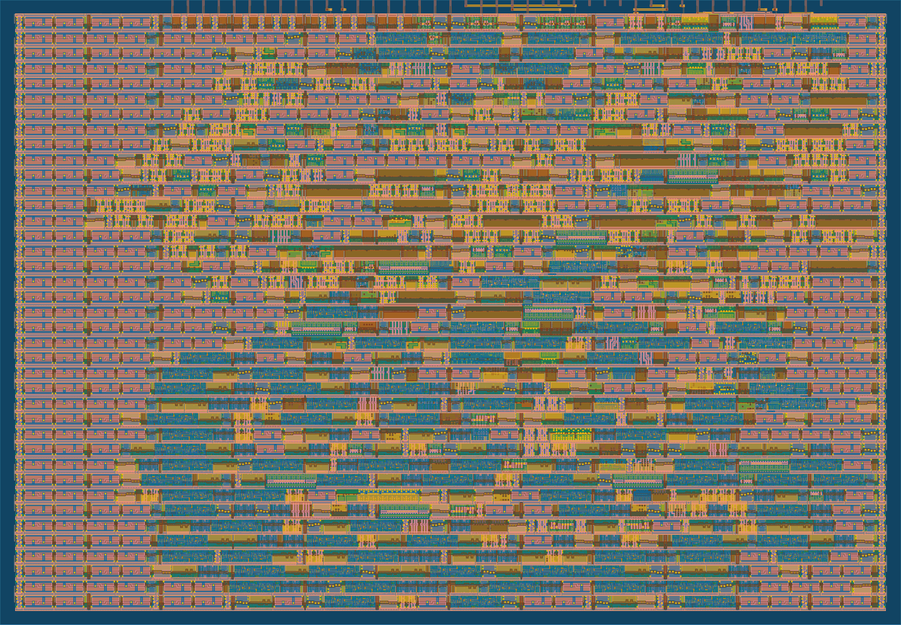

# 128-bit Streaming Feistel Cipher 

## Project Abstract

This project implements, verifies, and analyzes a 6‑round, 8‑bit streaming Feistel cipher across C (golden model), FPGA‑friendly RTL, and an ASIC synthesis/timing/power flow,completed in one weekend. A byte‑accurate C reference model established correctness and produced expected ciphertext/roundtrip vectors. The RTL core ([hdl_sim/feistelCipher128by6_opt.v](cci:7://file:///c:/Users/Sam/Desktop/FeistelCIpher-Silicon/128bitFeistelCipher/hdl_sim/feistelCipher128by6_opt.v:0:0-0:0)) realizes a single‑cycle, 6‑round compute with a 1‑cycle output pipeline and operand gating, wrapped by a simple command protocol for key load, `start_idx` set, and streaming. A self‑checking SystemVerilog testbench ([hdl_sim/feistelCipher128by6_opttb.sv](cci:7://file:///c:/Users/Sam/Desktop/FeistelCIpher-Silicon/128bitFeistelCipher/hdl_sim/feistelCipher128by6_opttb.sv:0:0-0:0)) drives realistic streams, aligns prime/drain latency, and validates roundtrip integrity while emitting artifacts to `hdl_sim/tests/{ciphertext,roundtrip}/`.

For ASIC evaluation, the design was synthesized in two variants (baseline and optimized key/logic organization) and characterized at `nom_ff_n40C_1v95` (Fast-Fast process, -40C, 1.95V). Reports in `asic/{no_optimizations,optimizations}/STA_n_POWER/nom_ff_n40C_1v95/` include internal minimum period, worst reg→reg paths, and vectorless power. The repository documents methodology, results, and concise reproduction steps to regenerate simulation outputs, STA, and power reports. Overall, the weekend deliverable demonstrates end‑to‑end implementation, verification, and ASIC feasibility with clear interfaces, automated checks, and reproducible metrics.

## C Simulation Golden Model

- **[purpose]** Byte-accurate reference of the 6-round Feistel algorithm to validate RTL and produce expected ciphertext/roundtrip.
- **[algorithm]**
  - 4-bit halves `L`, `R`; 6 rounds.
  - Round: `F(x,K) = (x + K) ^ rotl1(x)` on 4-bit nibbles.
  - Encrypt uses subkeys with `start_idx` for rounds r=0..5 (operate on `R`); decrypt r=5..0 (operate on `L`).
- **[I/O]**
  - Inputs: 16-byte key, byte stream plaintext, 1-byte `start_idx`.
  - Outputs: ciphertext; decrypting ciphertext returns original plaintext.
- **[usage]**
  - Run to emit ciphertext and roundtrip vectors; compare byte-wise to RTL outputs as the golden reference.

## RTL Model

- **[files]**
  - Core RTL: [hdl_sim/feistelCipher128by6_opt.v](cci:7://file:///c:/Users/Sam/Desktop/FeistelCIpher-Silicon/128bitFeistelCipher/hdl_sim/feistelCipher128by6_opt.v:0:0-0:0) (final optimized single-cycle).
  - Testbench: [hdl_sim/feistelCipher128by6_opttb.sv](cci:7://file:///c:/Users/Sam/Desktop/FeistelCIpher-Silicon/128bitFeistelCipher/hdl_sim/feistelCipher128by6_opttb.sv:0:0-0:0) (self-checking).
- **[interface]**
  - `ui_in[7:0]`: command/data input.
  - `uo_out[7:0]`: byte output (1-cycle output pipeline).
  - `uio_in[0]`: mode (0=encrypt, 1=decrypt), latched when not streaming.
  - `uio_in[1]`: stop pulse during streaming.
- **[protocol]**
  - From `SYS_IDLE`:
    - Write `0x01` then 16 key bytes (MSB-first) to load key.
    - Write `0x0F` then 1 byte to set `start_idx`.
    - Write `0x02` to enter streaming; present data bytes on `ui_in`.
    - Pulse `uio_in[1]` to stop and return to idle.
- **[final RTL configuration]**
  - Single-cycle 6-round compute (no internal round pipeline).
  - 1-cycle output register with valid: `uo_out = out_valid ? feistel_out_q : 8'h00`.
  - Key stored as bytes (`key_bytes[curr_seg]`) to avoid variable barrel slice.
  - `sys_next_state` defaults to `sys_state` in comb logic.
  - Operand gating: compute only in `SYS_STREAMING`; else drive zeros to reduce switching.
- **[TB behavior]**
  - 1-cycle prime before first capture, 1-cycle drain after last input.
  - Self-checks roundtrip; writes artifacts:
    - `hdl_sim/tests/ciphertext/ciphertext<i>.bin`
    - `hdl_sim/tests/roundtrip/roundtrip<i>.bin`
- **[how to run]**
  - `hdl_sim/tests/scripts/run_all_tests.sh` runs the suite (XSim), generates outputs, and performs self-checks.

## ASIC (Synthesis, Timing, Power)

- **[report locations]**
  - Non-optimized: `asic/no_optimizations/STA_n_POWER/nom_ff_n40C_1v95/`
  - Optimized: `asic/optimizations/STA_n_POWER/nom_ff_n40C_1v95/`
  - Includes: [clock.rpt](cci:7://file:///c:/Users/Sam/Desktop/FeistelCIpher-Silicon/128bitFeistelCipher/asic/optimizations/STA_n_POWER/nom_ff_n40C_1v95/clock.rpt:0:0-0:0) (min period), [max.rpt](cci:7://file:///c:/Users/Sam/Desktop/FeistelCIpher-Silicon/128bitFeistelCipher/asic/optimizations/STA_n_POWER/nom_ff_n40C_1v95/max.rpt:0:0-0:0) (reg→reg worst paths), [power.rpt](cci:7://file:///c:/Users/Sam/Desktop/FeistelCIpher-Silicon/128bitFeistelCipher/asic/optimizations/STA_n_POWER/nom_ff_n40C_1v95/power.rpt:0:0-0:0) (vectorless).
- **[timing @ nom_ff_n40C_1v95]**
  - Internal min period (period_min):
    - Non-optimized: `1.47 ns` → ~682.39 MHz
    - Optimized: `5.05 ns` → ~197.88 MHz
  - Worst reg→reg path (from [max.rpt](cci:7://file:///c:/Users/Sam/Desktop/FeistelCIpher-Silicon/128bitFeistelCipher/asic/optimizations/STA_n_POWER/nom_ff_n40C_1v95/max.rpt:0:0-0:0)):
    - Non-optimized: ~`0.926046 ns` (`_1147_ → _1145_`)
    - Optimized: ~`0.838149 ns` (`_1050_ → _1036_`)
  - Note: `period_min` alone can be misleading when internal reg paths are trivial; use worst reg→reg delay and WNS/TNS at a fixed period for fair comparison.
- **[power (vectorless, same corner)]**
  - Non-optimized total: ~`4.213 mW`
  - Optimized total: ~`6.074 mW`
  - Note: Vectorless ignores operand-gating benefits. For realistic power:
    - Dump VCD during TB: `$dumpfile("wave.vcd"); $dumpvars(0, feistelCipher128by6_tb);`
    - Convert to SAIF: `vcd2saif -input wave.vcd -output activity.saif -instance feistelCipher128by6_tb.iDUT`
    - Re-run `report_power` with SAIF for both builds.
- **[reproduce]**
  - Sim: run TB to generate ciphertext/roundtrip (and optionally VCD).
  - STA/Power: run the ASIC flow at `nom_ff_n40C_1v95` to produce [clock.rpt](cci:7://file:///c:/Users/Sam/Desktop/FeistelCIpher-Silicon/128bitFeistelCipher/asic/optimizations/STA_n_POWER/nom_ff_n40C_1v95/clock.rpt:0:0-0:0), [max.rpt](cci:7://file:///c:/Users/Sam/Desktop/FeistelCIpher-Silicon/128bitFeistelCipher/asic/optimizations/STA_n_POWER/nom_ff_n40C_1v95/max.rpt:0:0-0:0), and [power.rpt](cci:7://file:///c:/Users/Sam/Desktop/FeistelCIpher-Silicon/128bitFeistelCipher/asic/optimizations/STA_n_POWER/nom_ff_n40C_1v95/power.rpt:0:0-0:0) (and `power_saif.rpt` if using activity).

## Layout

- [README.md](cci:7://file:///c:/Users/Sam/Desktop/FeistelCIpher-Silicon/128bitFeistelCipher/README.md:0:0-0:0) — project overview, results, and reproduction steps

- `c_sim/src/feistelCipher128by6.c` — C golden model (byte-accurate reference)

- [hdl_sim/feistelCipher128by6.v](cci:7://file:///c:/Users/Sam/Desktop/FeistelCIpher-Silicon/128bitFeistelCipher/hdl_sim/feistelCipher128by6.v:0:0-0:0) — RTL core `tt_um_Samcooper01` (baseline)
- [hdl_sim/feistelCipher128by6_opt.v](cci:7://file:///c:/Users/Sam/Desktop/FeistelCIpher-Silicon/128bitFeistelCipher/hdl_sim/feistelCipher128by6_opt.v:0:0-0:0) — RTL core (final optimized single‑cycle)
- [hdl_sim/feistelCipher128by6_tb.sv](cci:7://file:///c:/Users/Sam/Desktop/FeistelCIpher-Silicon/128bitFeistelCipher/hdl_sim/feistelCipher128by6_tb.sv:0:0-0:0) — self‑checking testbench (baseline TB)
- [hdl_sim/feistelCipher128by6_opttb.sv](cci:7://file:///c:/Users/Sam/Desktop/FeistelCIpher-Silicon/128bitFeistelCipher/hdl_sim/feistelCipher128by6_opttb.sv:0:0-0:0) — self‑checking testbench for optimized RTL

- `hdl_sim/tests/scripts/run_all_tests.sh` — batch runner (WSL shell → Windows Vivado)
- `hdl_sim/tests/keys/.privatekey<i>` — 16‑byte private keys (e.g., `.privatekey0`)
- `hdl_sim/tests/plaintext/plaintext<i>.txt` — plaintext bytes (e.g., `plaintext0.txt`)
- `hdl_sim/tests/ciphertext/ciphertext<i>.bin` — generated ciphertext (ASCII ‘0’/‘1’ bitstring)
- `hdl_sim/tests/roundtrip/roundtrip<i>.bin` — decrypt output for round‑trip check
- `hdl_sim/tests/roundtrip/wave_<i>.wdb` — optional waveform DBs (when enabled)

- [asic/no_optimizations/STA_n_POWER/nom_ff_n40C_1v95/clock.rpt](cci:7://file:///c:/Users/Sam/Desktop/FeistelCIpher-Silicon/128bitFeistelCipher/asic/no_optimizations/STA_n_POWER/nom_ff_n40C_1v95/clock.rpt:0:0-0:0) — clock properties, min period
- [asic/no_optimizations/STA_n_POWER/nom_ff_n40C_1v95/max.rpt](cci:7://file:///c:/Users/Sam/Desktop/FeistelCIpher-Silicon/128bitFeistelCipher/asic/no_optimizations/STA_n_POWER/nom_ff_n40C_1v95/max.rpt:0:0-0:0) — worst reg→reg paths (setup)
- [asic/no_optimizations/STA_n_POWER/nom_ff_n40C_1v95/power.rpt](cci:7://file:///c:/Users/Sam/Desktop/FeistelCIpher-Silicon/128bitFeistelCipher/asic/no_optimizations/STA_n_POWER/nom_ff_n40C_1v95/power.rpt:0:0-0:0) — vectorless power

- `asic/optimizations/feistelCipher128by6_opt.v` — RTL snapshot for ASIC (optimized)
- [asic/optimizations/STA_n_POWER/nom_ff_n40C_1v95/clock.rpt](cci:7://file:///c:/Users/Sam/Desktop/FeistelCIpher-Silicon/128bitFeistelCipher/asic/optimizations/STA_n_POWER/nom_ff_n40C_1v95/clock.rpt:0:0-0:0) — clock properties, min period
- [asic/optimizations/STA_n_POWER/nom_ff_n40C_1v95/max.rpt](cci:7://file:///c:/Users/Sam/Desktop/FeistelCIpher-Silicon/128bitFeistelCipher/asic/optimizations/STA_n_POWER/nom_ff_n40C_1v95/max.rpt:0:0-0:0) — worst reg→reg paths (setup)
- [asic/optimizations/STA_n_POWER/nom_ff_n40C_1v95/power.rpt](cci:7://file:///c:/Users/Sam/Desktop/FeistelCIpher-Silicon/128bitFeistelCipher/asic/optimizations/STA_n_POWER/nom_ff_n40C_1v95/power.rpt:0:0-0:0) — vectorless power

## Testbench features

- **Tasks**: `tb_reset()`, `tb_set_key()`, `tb_set_start_idx()`, `tb_start_stream()`, `tb_stop_stream()`, `tb_stream_bytes()`, `tb_run_pass()`
- **Self‑check**: compares decrypted round‑trip output to original plaintext; `$fatal` on mismatch
- **Assertions** (selected):
  - **Stream integrity**: mode fixed during stream; no unexpected stop while streaming
  - **Unknowns**: `uo_out` must not be X/Z during stream
  - **Idle behavior**: when fully idle (not streaming and post‑stop grace window elapsed), `uo_out == 8'h00` and known
  - **Stop latency**: allow a 2‑cycle grace window, then require `uo_out == 0`
  - **Key load**: exactly 16 bytes loaded (TB-side counter)

## Roadmap (hardening + sign‑off)

- **Cipher hardening** (if security is a goal):
  - Full‑byte key mixing per round, S‑box in F, 12–16+ rounds
  - Whitening and inter‑byte diffusion; stronger key schedule
  - Or implement a standard (PRESENT or AES‑128 serial)
- **Verification depth**:
  - Add SVAs bound to DUT state (state-gated checks, stop→idle latency)
  - Functional coverage (bins for `start_idx`, mode, data classes)
- **GLS**:
  - Synthesize to a gate‑level netlist and run the same TB
  - Compare outputs and (optionally) run with SDF timing
- **Docs/CI**:
  - Add a concise CI or Makefile; pin Vivado version in README

## Results (STA, reg→reg)

- **[corner]** `nom_ff_n40C_1v95`

- **[worst reg→reg path: optimized]** `asic/optimizations/STA_n_POWER/nom_ff_n40C_1v95/max.rpt`
  - Path: `Startpoint: _1050_ (FF)` → `Endpoint: _1036_ (FF)`
  - Data arrival time: `0.838149 ns`

- **[worst reg→reg path: non-optimized]** `asic/no_optimizations/STA_n_POWER/nom_ff_n40C_1v95/max.rpt`
  - Path: `Startpoint: _1147_ (FF)` → `Endpoint: _1145_ (FF)`
  - Data arrival time: `0.926046 ns`

- **[implication]** Based on worst reg→reg data arrival, the optimized build has a shorter internal critical path (~0.84 ns vs ~0.93 ns), i.e., higher core Fmax for reg→reg logic. Use this alongside `report_clock_min_period` and WNS/TNS@fixed period for a complete picture.

## Final RTL configuration

- **[rounds]** Single-cycle 6-round compute in `hdl_sim/feistelCipher128by6_opt.v` (no internal round pipeline).
- **[output pipeline]** 1-cycle register on `feistel_out` with `out_valid` gating; `uo_out = out_valid ? feistel_out_q : 8'h00`.
- **[key]** Key bytes captured into `key_bytes[15-counter]` and selected via `key_bytes[curr_seg]` (avoids variable barrel select).
- **[FSM]** `sys_next_state` defaulted to `sys_state` in the comb next-state block.
- **[operand gating]** Round compute only when `sys_state == SYS_STREAMING`; `feistel_out = 8'h00` otherwise.

## Final Results Summary

- **[corner]** `nom_ff_n40C_1v95`
- **[internal Fmax (period_min)]**
  - Non-optimized: `period_min = 1.47 ns` → ~682.39 MHz (`asic/no_optimizations/.../clock.rpt`)
  - Optimized: `period_min = 5.05 ns` → ~197.88 MHz (`asic/optimizations/.../clock.rpt`)
  - Note: Period_min is an internal reg→reg metric and may appear higher for designs with trivial reg→reg paths. See reg→reg worst-path below for a fairer comparison.
- **[worst reg→reg delay (max.rpt)]**
  - Non-optimized: ~0.926046 ns (`_1147_ → _1145_`)
  - Optimized: ~0.838149 ns (`_1050_ → _1036_`)
- **[power (vectorless)]**
  - Non-optimized total: ~4.213 mW (`asic/no_optimizations/.../power.rpt`)
  - Optimized total: ~6.074 mW (`asic/optimizations/.../power.rpt`)
  - Note: Vectorless power does not reflect operand gating benefits. Use activity-based power for realistic results.
